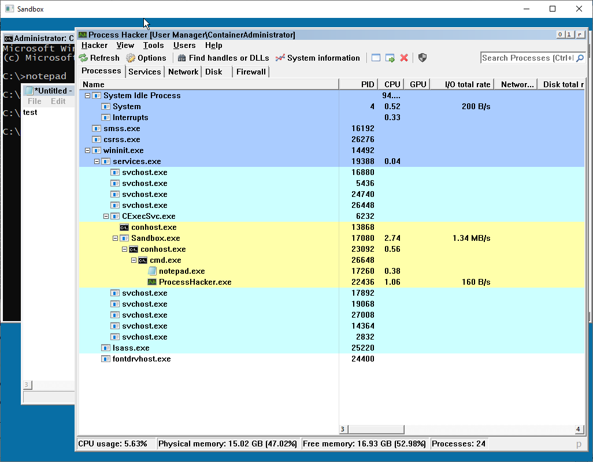
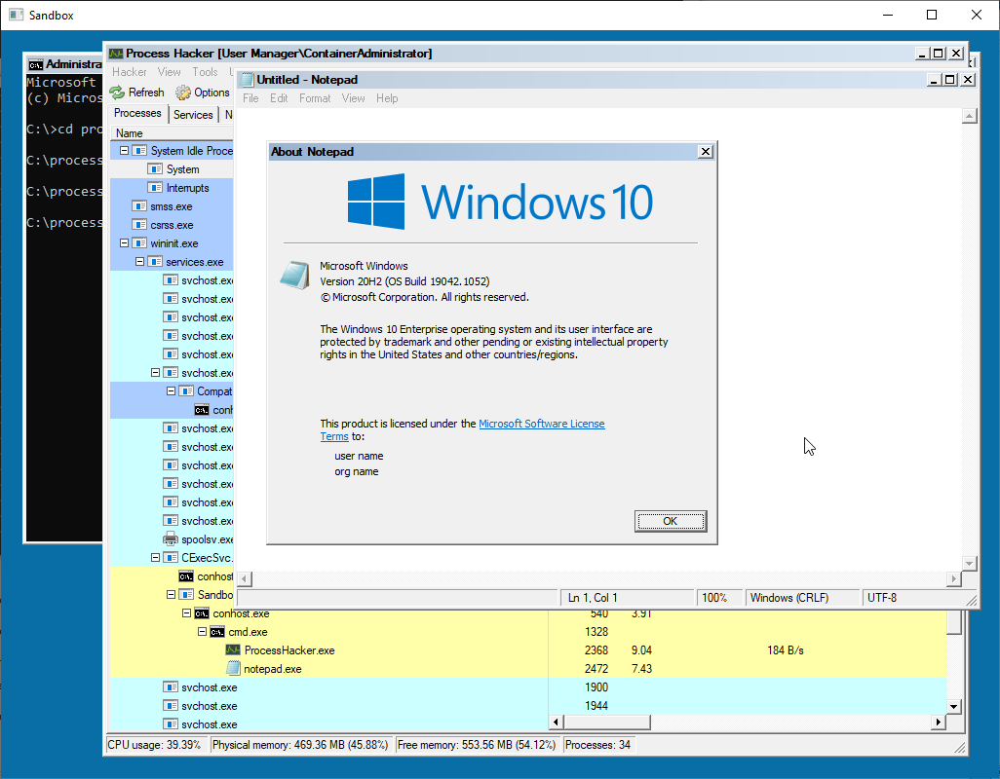

= Windows Container View

This tool allows anyone to view and control the graphical user interface of a Windows Container.



== Requirements

- Visual Studio 2019
- SDL2
- Docker (at the time of writing, it's the only software that can spawn Hyper-V Containers and Server Silos)

Just build the solution.

== Running

. Run sandbox.exe on your host computer, a white window should appear, waiting for the client connection.

. Run a container by mounting a directory to the output executable path (including SDL2.dll). The container must execute the Sandbox executable with the "client" arguments, following by the host IP address, i.e: `C:\Sandbox\Sandbox.exe client 192.168.1.50`. The minimal requirement for the image is server core. Nano server won't work because it strips Win32K (graphical user interface). The container can run with process and hyper-v isolation.

. The sandbox running on your host computer should now display the container's GUI, with a console window in it. Programs (like Process Explorer or Process Hacker) can be started from it.

Example:
```
docker run --rm -ti --isolation process -v D:\Sources\Sandbox\Output\x64\Release:C:\Sandbox:ro -v "D:\Tools\ProcessHacker":C:\ProcessHacker mcr.microsoft.com/windows/servercore:20H2 C:\Sandbox\Sandbox client 192.168.1.50
```

== How it works

The program uses the PrintWindow() API on each window to write their visual into a Device Context. PrintWindow() only works for windows inside a window station that allows I/O, which is WinSta0, otherwise the output result is black.

By default, applications are assigned to the service window station (Service-0x0-xxx$). Access rights are insufficient to assign ourselves to WinSta0, switch desktop and create windows. The console container must belong to a desktop inside WinSta0 to be able to send input.

. The program sets all access rights for everyone on the WinSta0 window station, and the WinSta0\Default desktop object.
. It assigns itself to WinSta0, and set its thread's desktop to WinSta0\Default.
. It switches the console container to the WinSta0\Default desktop, so input will work.
. After initializing, it prints individual windows into a bitmap buffer which will be sent over the network to the sandbox server, using RPC.

== Epilogue

This program is for educational/research purposes. It is a POC that even if a container is headless, visual information can be retrieved.

Examples of use cases where this technique can be used:

- To allow IT administrators to install programs in a container that require user interaction (like using the GUI installer from a software, and entering the license key), and export the container when finished.
- It can also be used to navigate to the host session 0 for services that require user interaction.
- It can be used to test suspicious program in a lightweight Sandbox (it works in an Hyper-V container)
- It could be used in conjunction with a sandbox technology that let users easily spawn processes inside one or more sandboxes (Server Silo, or Hyper-V container) and retrieve their visual output like Windows Defender Application Guard for Microsoft Edge. A Server Silo, even if less secure, has the advantage of being faster than a VM (uses the host kernel), and has the advantage of being able to forward devices easier.


